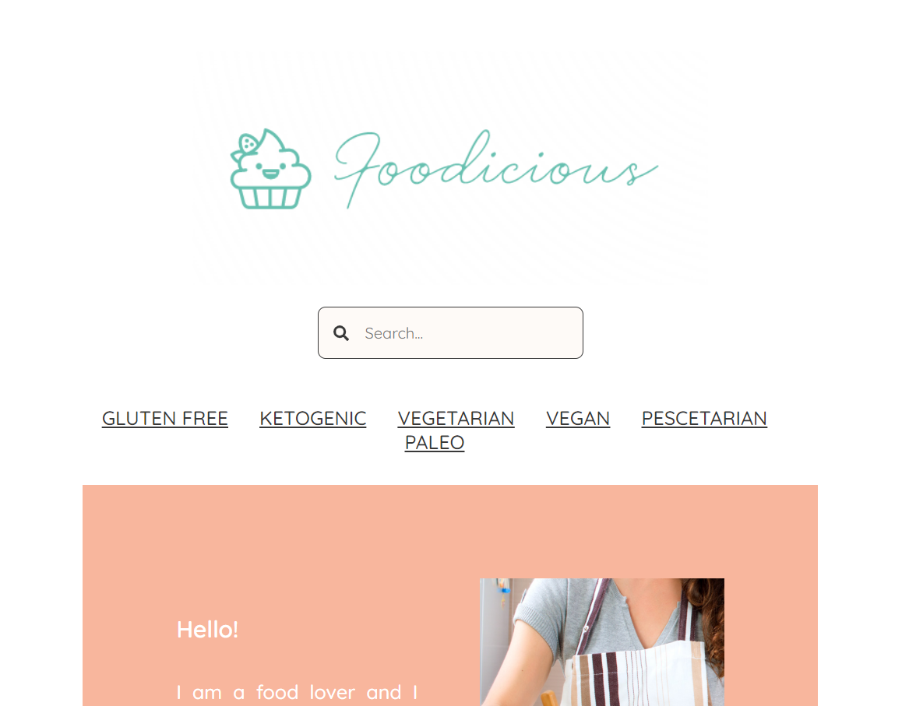
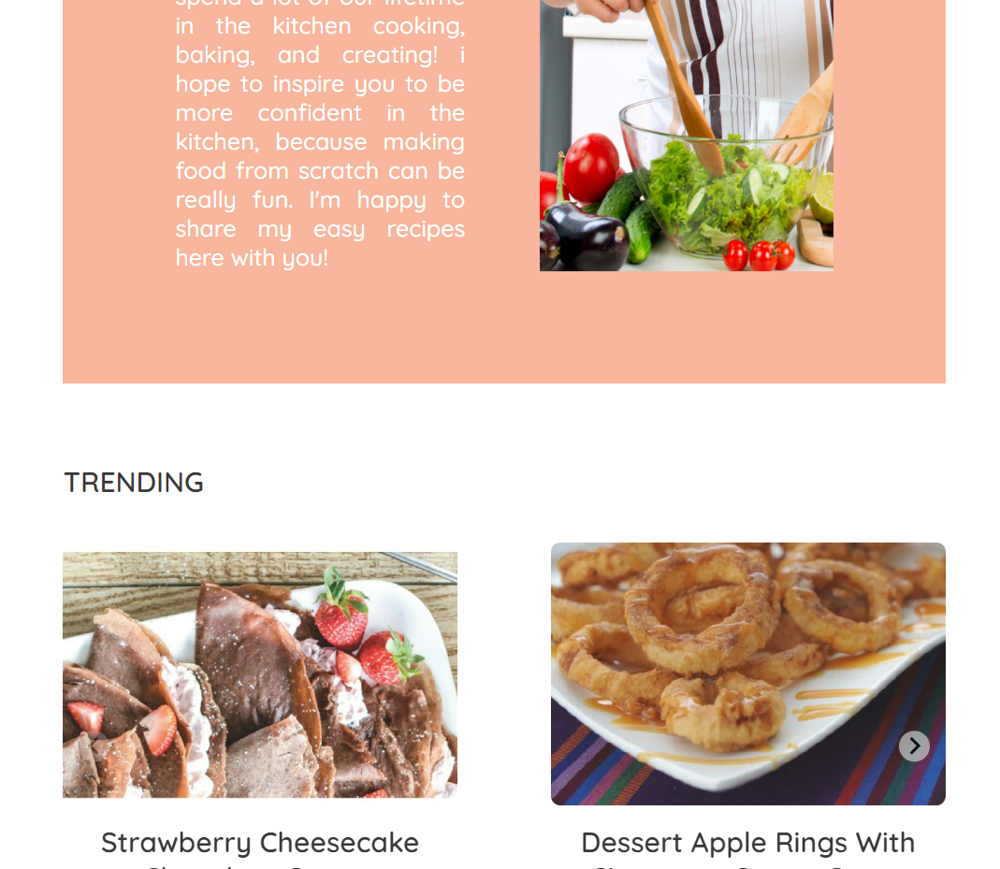
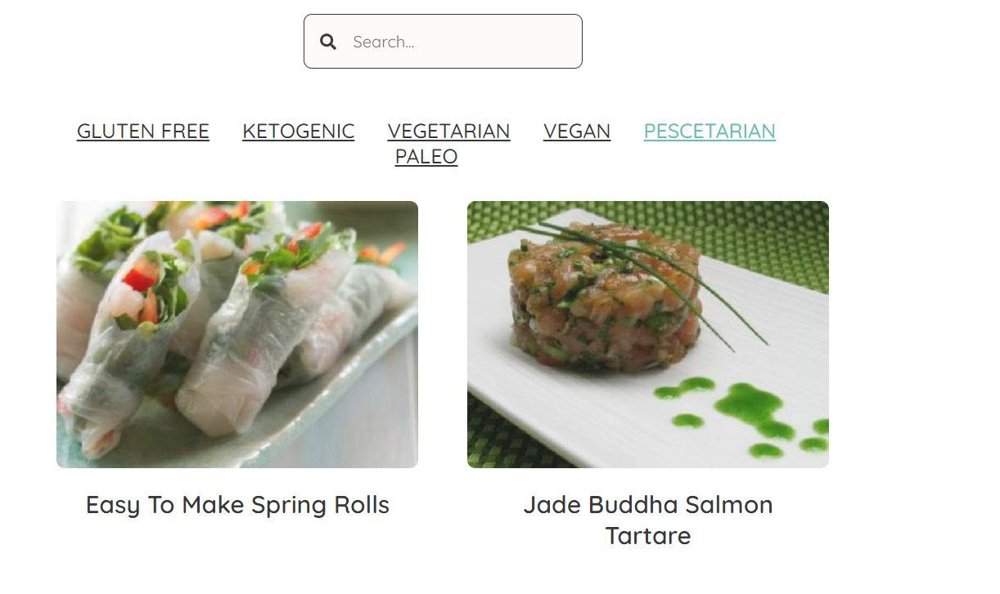
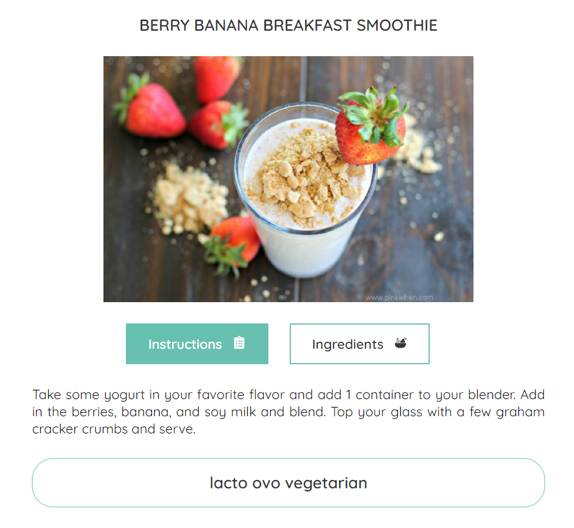
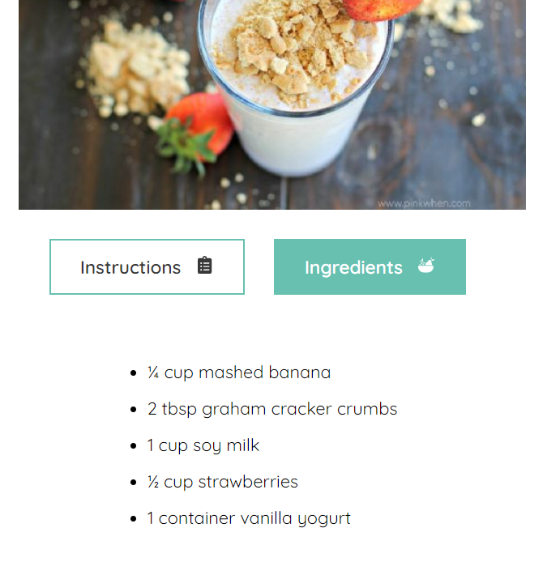
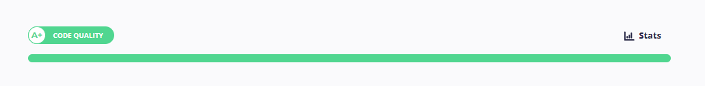

# Foodicious

Foodicious is a project made with Vite and stylized with styled components.

## Installation

In the project directory, you should run:

### `npm install`

### `npm run dev`

Runs the app in the development mode.

The page will reload when you make changes.\
You may also see any lint errors in the console.

## About the project

This project is for a JOBarcelona Hackaton. This challenge consists to create a website that shows different dishes and their details through the Spoonaculat API, which is an API that provides all kinds of food information: recipes, ingredients, nutrients, etc.

## Objectives

-Have a card layout that contains Recipe images (even if it is not directly connected to the API). They can be popular recipes, random, organized in categories, etc.

-Make API requests to load recipes for various dishes.

-By clicking on a recipe, navigate to another route where there is more information about that dish. You can show what you want, but at least you would have to see the ingredients. There must be some way to go back.

-Implement a search bar and/or filters.

## Screenshots

# Home

# Layout

# Recipe

# CodeFactor

## Link

<a>https://master--profound-puffpuff-41697f.netlify.app/</a>

